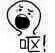
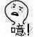
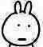

## 前言
从11月开始学前端。在这之前连代码都没有碰过。掘金有很多的大牛分享自己对代码的理解，都很高屋建瓴，但是没有真正属于我们这些，还在新手村彷徨的人的代入感。这篇文章技术性可能不强，但是我想让一些跟我一样迷茫的小白，比他们还菜但是也不放弃甚至还敢发文章。我会努力学习下去，也希望看到这篇文章的人能坚持下去，大牛大佬大神，宁有种乎。
## 如何当好一个截图仔？
如果我们要做一个台灯出来，灯罩灯架什么的就是html；灯罩上的花纹，灯架的弯折程度就是css；控制它发亮，就是js。你自己去买材料，做灯罩，做灯泡，然后通电发亮，这就叫原生js。你去店里买灯泡，这就是组件，你去超市，不光给你卖灯泡，还给你卖灯罩，卖灯架，这个超市就叫框架。
#### **这个框架，如果在微信里面，就叫小程序。**
小程序这个名称十分贴切，小：每个小程序都小于2M，程序：界面风格仿造app。今天就跟大家分享一下，怎么在这个叫小程序的超市里面，买上灯泡，做一盏灯。


----------


## 我们为什么要做小程序
因为小，所以简单，适合新手；也因为小，所以它的界面很简洁，在因为东北重工业死亡金属风的洗礼，大家的表情包也从


变成了


最初国内对前端的要求，是哎呀这个页面里面好全哦什么功能都有很棒了虽然都在第一个页面虽然有点乱的看不出来什么是主次怎么越看越晕啊呀好想吐呕但是还是好棒

后来有一家公司出现了，它的logo是一个被咬了一口的苹果，它的公司的ceo是一个完美主义的暴君，它的手机砸烂了市场上的板砖机，它的app，轰开了人们的审美，让大家知道了，简单不等于简洁，复杂也只是是简单的堆积。重剑无锋，大巧不工。

而小程序，受限于大小，被迫简单（当然做得好就是简洁），而又因为代码复杂度低，满足度高，因为小程序的这些特性，所以它适合新手练手。Lingvist 是一个AI智慧学习英语的app，十分简洁，清爽。这也是我用小程序仿它的缘故。**清爽即正义，简洁即真理。**
### 准备工作
#### [如何下载][6]


#### [小程序须知][7]


注：关于小程序的理解我不会比网上的更深刻，如果懒得看网上教程的，只要注意，html在小程序里面叫wxml；css叫wxss；html中的盒子也就是div，在小程序中叫view。
### 页面仿制


这是这个app的第一面，我用原生写的，写了断断续续6个小时左右，虽然在超市买好东西组装很爽，但是要自己一点一点做才是自己的，别人的组件，终究是别人的东西。限于篇幅，最基本的东西大家可以去看[w3school][9]。


### 关于css
我有一个概念，比如html是你，那盒子就是你的身体的组成部分，css就是你的衣服首饰什么的，一个人可以穿很多件衣服，一件衣服也可以很多人穿。但是你戴隐形眼镜加黑框眼镜加3D眼镜再带VR眼镜会被质疑智力，盒子也一样，约定俗成其中的css一般不超过三个。

一个css代码，你用拼音来命名，这就是拿了片叶子遮羞，见不了人；你用英文命名，命名到后面掏出牛津字典想名字，这就是件你戴的你妈拿你爸裤子改的口罩，自己搁家里戴着得了。如何要把这件衣服卖别人，就涉及到代码复用，因为第一页是用原生做的，所以有意识的注意了代码的复用，不过只是按我理解的，采用了BEM命名方法，让代码可以复用。

BEM：这是一大块_这是一小块_这是它的状态

    <view class="body">    
        <view class="title_hd"></view>    
        <view class="title_bd"></view>
      <view class="span_box">    
            <view class="span_box_pic">            
                <image src=""/>       
            </view>       
         <view class="span_box_hd_Explain"></view>        
         <view class="span_box_bd_Explain"></view>    
      <view class="box_ft">         
          <view class="span_ft left">            
          <view class="span_ft_title">
      </view>           
       <view class="span_ft_Explain"></view>        
      </view>           
        <vi-ew class="span_ft right">           
             <view class="span_ft_right_title"></view>           
             <view class="span_ft_right_Explain"></view>       
        </vi-ew>     
            </view>
            </view>
            <view class="end_box">
                <view class="end_box_hd">
                </view>
                    <view class="end_box_bd">
                            <view class="end_box_bd_main left></view>        
                            <view class="end_box_bd_main middle"></view>        
                            <view class="end_box_bd_main right"></view>                                
          </view>    
                            <button class="btn"></button>
                            </view>
                            </view>
     

当然更正统的分析，可以看看[这篇][10]。


当然不光是衣服，还有首饰，有些可以被到处引用的就像一个链子，你带脖子上叫项链，放手上叫手链，脚上放脚链。

比如弹性布局：

    display: flex;    
    flex-direction:column;    
    align-items:center;
更详细的请看阮一峰大佬的[这篇][11]


要注意的有几点：

- 使用[Mark Man][12]，获得图的距离，颜色等参数，再用网上一些[在线识别图中字体][13]来获取字体
- 里面的图片，可以用去[Iconfont][14]里面下，或者用祖传的ps自己截，仿图就是这样的，熬出头就会有可爱的会嘤嘤嘤的设计师小姐姐给你发素材了
- 中间那个国旗的盒子，用一个盒子，通过border-radious：50%弄成圆，然后外面套一个盒子做成这个效果。
```
<view class="span_box">   
 <view class="span_box_pic">            
    <image src=""/>      
  </view>
</view>
.span_box{    
display: flex;    
flex-direction:column;    
align-items:center;    
width: 100%;   
height: 50vh;    
margin-top: 100rpx;   }
.span_box_pic image{    
border-radius: 50%;
width: 230rpx; 
height: 230rpx; 
 }
.span_box_pic{    
display: flex;    
flex-direction:row;    
align-items:center;    
justify-content: center;    
border: 2rpx solid #bbbbbb;    
border-radius: 50%;    
width: 240rpx;    
height: 240rpx;  
}
```
 - 蒙版效果，就是两个函数，一个让图弹出来，一个让周围变暗


具体js如下：
```
 data: {
    one:false,
    showModalStatus: false,
    content:"",
    src:"",

  },
  powerDrawer: function (e) { 
    var currentStatu = e.currentTarget.dataset.statu;
    if(currentStatu=="open1"){
        this.setData({
          content:"每日目标：完成100张字卡",
          src:"../../images/aactive1.png"
        })
        currentStatu ="open"
    }
    if(currentStatu=="open2"){
      this.setData({
        content:"每日目标：增加20个生词",
        src:"../../images/active2.png"
      })
      currentStatu ="open"
    }
    if(currentStatu=="open3"){
      this.setData({
        content:"每日目标：将复习答对率提升到80%",
        src:"../../images/active3.png"

      })
      currentStatu ="open"
    }
    this.util(currentStatu) 
    setTimeout(()=>{
      this.setData({
        one : true,

      })
    },150) 
  }, 
  util: function(currentStatu){ 
    /* 动画部分 */ 
    // 第1步：创建动画实例   
    var animation = wx.createAnimation({ 
      duration: 200,  //动画时长  
      timingFunction: "linear", //线性  
      delay: 0  //0则不延迟  
    });  
       
    // 第2步：这个动画实例赋给当前的动画实例  
    this.animation = animation;  
   
   
    // 第3步：执行第一组动画  
    animation.opacity(0).rotateX(-100).step();  
   
    // 第4步：导出动画对象赋给数据对象储存  
    this.setData({ 
      animationData: animation.export() 
    }) 
       
    // 第5步：设置定时器到指定时候后，执行第二组动画  
    setTimeout(function () { 
      // 执行第二组动画  
      animation.opacity(1).rotateX(0).step();  
      // 给数据对象储存的第一组动画，更替为执行完第二组动画的动画对象  
      this.setData({ 
        animationData: animation  
      }) 
         
      //关闭  
      if (currentStatu == "close") { 
        this.setData( 
          { 
            showModalStatus: false ,
            one:false
          } 
        );  
      } 
    }.bind(this), 200) 
     
    // 显示  
    if (currentStatu == "open") { 
      this.setData( 
        { 
          showModalStatus: true 
        } 
      );  
    } 
  } ,
```
### **wx：for 循环**


然后就是切换到已学单词界面，重复的格式所以我选择用循环来做。当然

```
<view class="center" wx:for="{{array}}" wx:for-index="idx" wx:for-item="itemName">    
<view class="word_hd">{{itemName.word}}</view>    
<view class="word_bd">{{itemName.lasttime}}</view>    
<view class="word_ft">{{itemName.times}}</view>  
</view>
array: [{
      word:"age",
      lasttime:"15",
      times:"1",
      message: 'foo',
          }, {     
           word:"anybody",      
           lasttime:"15",
           times:"2",      
           message: 'bar'    },
```
首行固定的效果用css中的fixed固定它。下面的滚动用scroll来做。

```
.fixed{    width: 100%;    position: fixed;    z-index: 9999;}
<scroll-view scroll-y style="height:80vh;padding-top: 200rpx;"></scroll-view>
```
### 其他界面
#### 衣服堆-组件
在我仿完第一个界面之后，我意识到这个进度我圣诞节前都仿不完全部的（好像有借口为什么圣诞节没人陪了），我选择了小程序的组件，别被我前面贴的代码打昏了，我们可是在超市啊！全部买材料自己做是不是太傻了！

然后我给大家介绍一下，[小程序的组件][17]，里面有很多的效果，请大家自己看。

而且，前端并不要求，你在这家沃尔玛，不能买家乐福的东西，所以你可以在小程序里面，使用weui这种框架（库类？）。

weui其实就是衣服堆，里面堆满了别人写好的衣服，你想要哪一件，把衣服的名字写上去，就能穿了。但是你需要把这个衣服堆，完整的搬到你的小程序里面来，才能使用。而且，weui在小程序里面的名字是weui.wxss，你装错了并不能运行。

又因为小程序的一部分组件和weui中的一样，所以在weui.wxss中，就没有写。点这里是weui哦，点开这个·网址你会发现，为什么只有效果，没有代码？这个时候请你右键审查元素，通过代码找到它的CSS类名，原样放进你的盒子就好了。因为你已经下好了衣服堆，所以你去看模特背后的牌子，回自己的衣服堆里翻出那件牌子的衣服穿上就好了。

然后，经过很久很久的仿制，你就能做出这些效果


多插一句，那个被选中的效果}O@I5N9NU~1V$}EO}S.jpg)，用伪元素做，before做绿色的圆形背景，after做√。

```
  .weui-cell__ft_in-access:after{
    height:10rpx;
    width:20rpx;
    transform:rotate(135deg);
    top:-50rpx;
    right:15rpx;
    border-color: #ffffff;
}
.weui-cell__ft_in-access:before{
    content: "";
    display: block;
    position: absolute;
    width: 50rpx;
    height: 50rpx;
    background-color: #338499;
    border-radius: 50%;
    top:-72rpx;
    left: 488rpx;
}
```
伪元素十分适合做这种类似符号的东西。

前面我只放了代码还有效果以及造成这个效果的原因。没有讲解具体原因，因为我觉得自己还没看透，不想误人子弟。另一方面我想给大家搜索这些效果提供一个方向。

如果加一个数据库，能够把数据往后台存储，这个小程序就勉强完成了。难度不大，但是真的很好看！**清爽即正义，简洁即真理！**
最后的一些提示：

- 关于颜色，用#000000而不是black，red这种，有些时候后者并不会被识别
- css的开头，最好在全局都写一个margin: 0;padding: 0;position: relative;去除因为浏览器造成的问题
- 多看文档，不需要你能打出来，只需要你再需要这个效果的时候知道百度什么关键词
我写了很多仿佛废话的提示，因为作为一个0基础，真真的哪里都是坑，很多大家知道的常识，我都不知道。所以我希望，通过这些废话，能帮到哪怕一个人也好。还有里面可能有错误，改错也是学习。有问题请联系qq：940223872，备注掘金哦~
关于前端有什么问题，也可以联系一直教我的两个大佬，[松松][22]，[超哥][23]。我自己的[githup][24]

诸君加油，大神大牛大佬，宁有种乎。保持学习，一直学习~
                                                                 朱某人敬上


  [1]: /img/bV0hzE
  [2]: /img/bV0hzR
  [3]: /img/bV0hzQ
  [4]: /img/bV0hz6
  [5]: /img/bV0hz7
  [6]: https://jingyan.baidu.com/article/642c9d3411f0cd644a46f7e8.html
  [7]: https://jingyan.baidu.com/article/642c9d3411f0cd644a46f7e8.html
  [8]: /img/bV0hCm
  [9]: http://www.w3school.com.cn/
  [10]: https://juejin.im/entry/5a139a7a51882503dc5353b2
  [11]: http://www.ruanyifeng.com/blog/2015/07/flex-grammar.html
  [12]: http://getmarkman.com/
  [13]: http://www.qiuziti.com/
  [14]: http://www.iconfont.cn/
  [15]: /img/bV0hJN
  [16]: /img/bV0hL5
  [17]: https://www.w3cschool.cn/weixinapp/itz51q8o.html
  [18]: /img/bV0hNU
  [19]: /img/bV0hN1
  [20]: /img/bV0hN7
  [21]: /img/bV0hOf
  [22]: https://juejin.im/user/59fc41d96fb9a044fb071d9d
  [23]: https://juejin.im/user/59fb3083f265da4318761784
  [24]: https://github.com/ZhuRon/mylessonData
